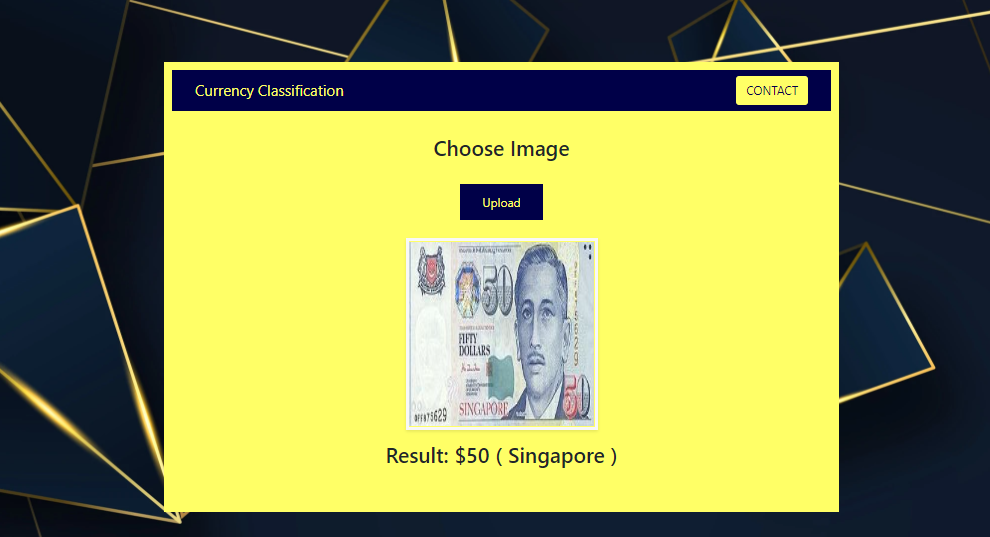
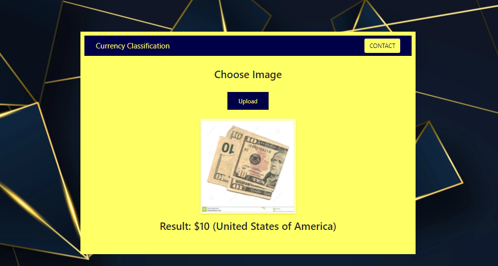
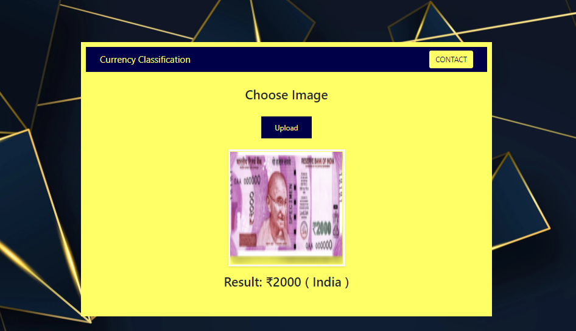
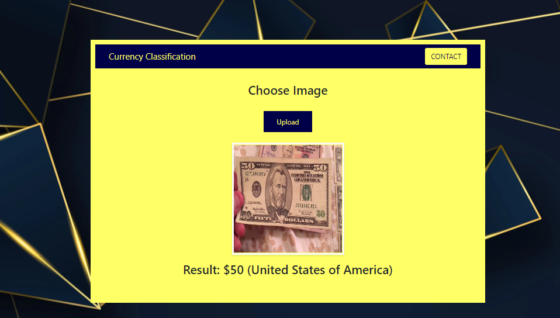
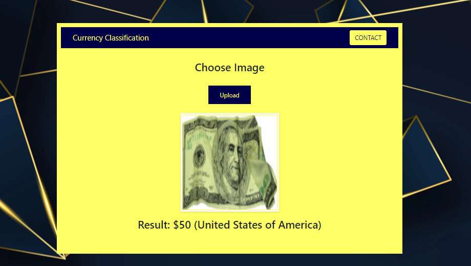

Currency Image Classification Project:

* A classification model which predicts the country and denomination of a currency. 

* The dataset is created using Data Augmentation.

* Architecture - VGG-16.

* Deployment is done using Flask Framework.

* The model is initially created with 3 countries : India, Singapore and United States of America.

Screenshots of the webpage / Demo :

Thank you!
